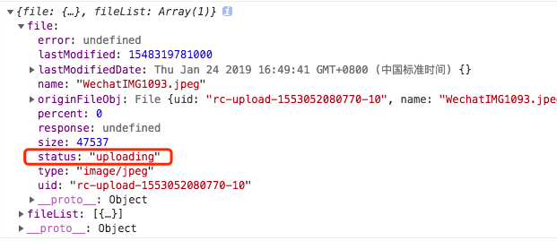

### 常见问题汇总
#### upload
> fileList :已经上传的文件列表（受控），使用此参数时，如果遇到 onChange 只调用一次的问题，请参考 [#2423](https://github.com/ant-design/ant-design/issues/2423) 
> upload 组件上传之后,file的状态一直处于uploading状态
``` javascript
    handleChange = (res: any, info: any) => {
        // 1. Limit the number of uploaded files
        // Only to show two recent uploaded files, and old ones will be replaced by the new
        let fileList = info.fileList.slice(-1);
         // 2. Read from response and show file link
        fileList = fileList.map((file: any) => {
        if (file.response) {
                let url = res.imgLink;
                file.uid = res.id;
                file.name = res.gradeName;
                file.thumbUrl = url;
                file.url = url;
            }
            return file;
        });
         // 3. Filter successfully uploaded files according to response from server
        fileList = fileList.filter(function (file: any) {
            if (file.response) {
                return file.response.code === 0;
            }
            return true;
        });

        this.setState({ fileList } });
    }
   
```


### 引用（嵌套引用）
> geugh 
>>wide 
>>> inner

### 代码块
```java
public class User{
        private String name;

        public String getName() {
            return name;
        }

        public void setName(String name) {
            this.name = name;
        }
    }

```
### 分割线
---
***
### 链接
添加链接[链接描述](链接)  或者<链接>
* [github](https://github.com)  
* <https://github.com>